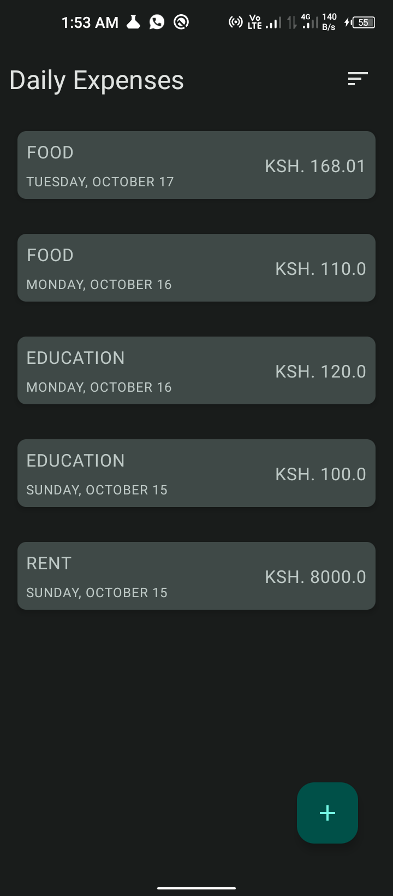
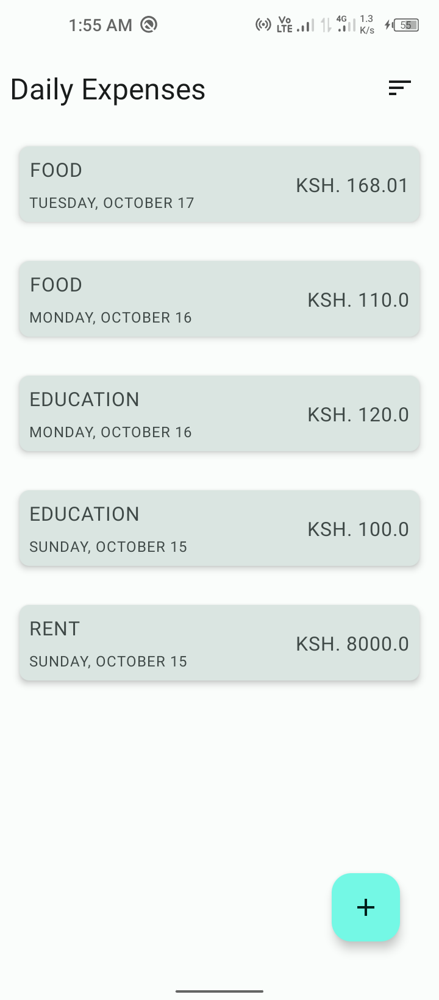
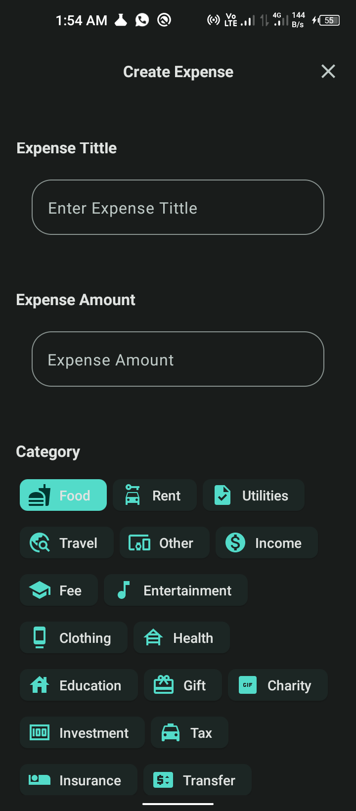
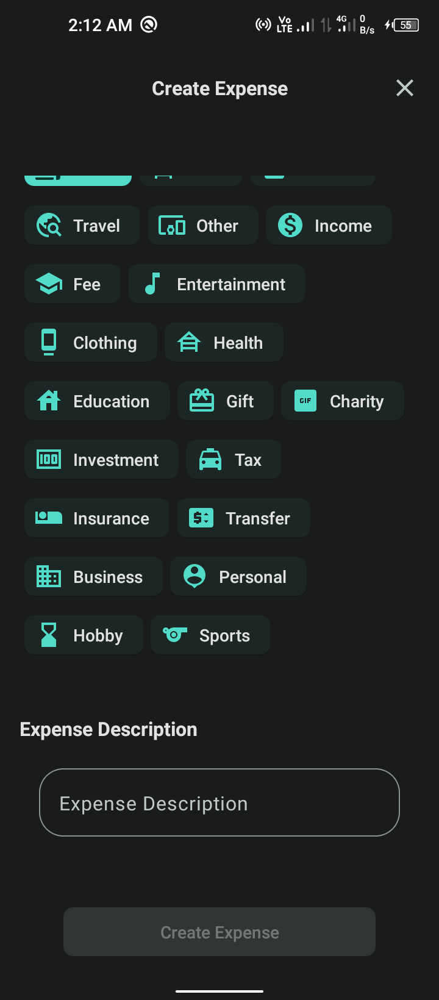
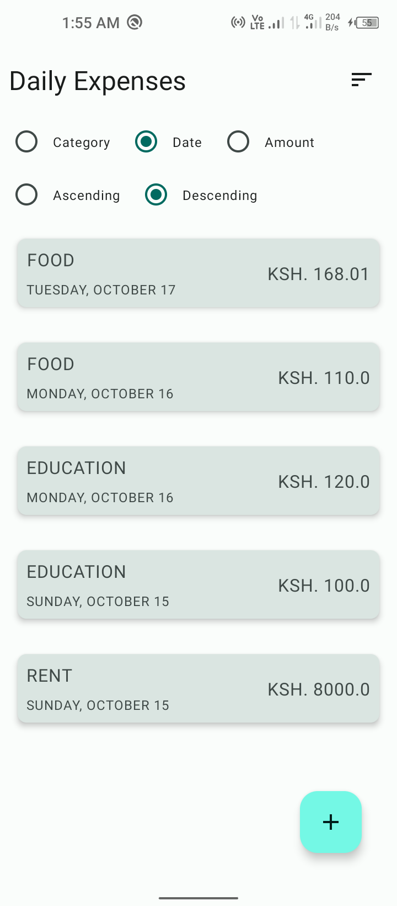

Minimally track Your daily expenses, categorize them, and analyze Your spending habits.

## Features

- View and categorize daily expenses.
- See a breakdown of expenses by category.
- Sort and filter expenses based on date, category, or amount.
- Analyze spending habits over time.

## Screenshots

Here are some screenshots of the Work in progress Expense Tracker app:

| Screen Dark                                                                     | Expenses List  Light                                                 | Add                                                                |
|---------------------------------------------------------------------------------|----------------------------------------------------------------------|--------------------------------------------------------------------|
|  |  |  |
|                 |        |    |

## To-Do Features

Here are some planned features and improvements for future development:

- **Expense Report**: Generate expense reports and export them as PDF or CSV.
- **Budgeting Tools**: Introduce budget creation and tracking functionality.
- **Data Analysis**: Enhance data analysis with charts and graphs.